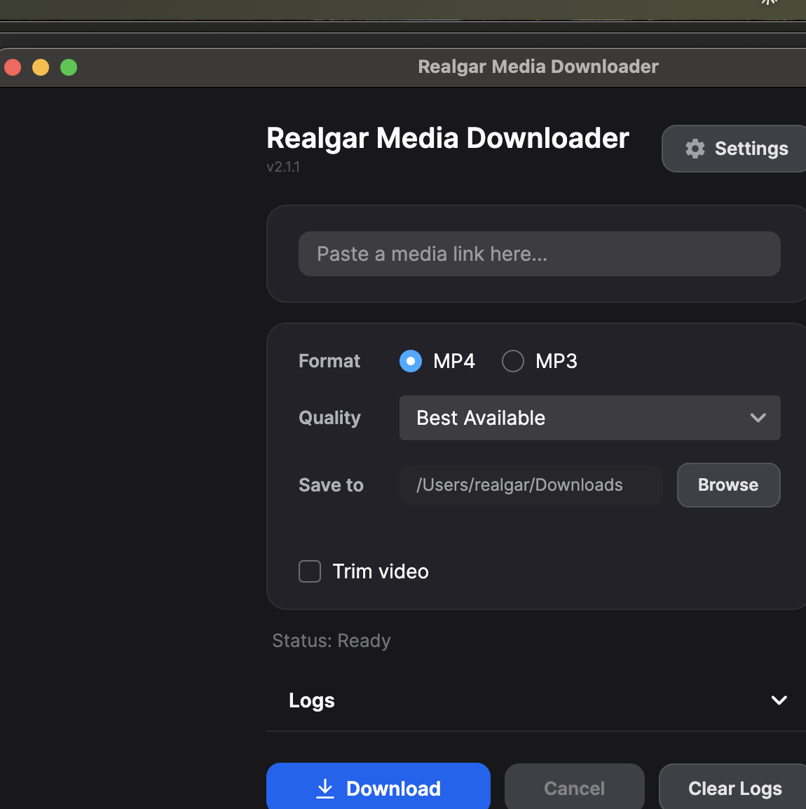

# RealSnag Media Downloader

A cross-platform media downloader built with Avalonia UI and yt-dlp.



## Features

- Download video (MP4) and audio (MP3) from supported sites
- Quality selection — choose 4K, 1080p, 720p, or best available
- Video trimming — cut start/end times before downloading
- Automatic metadata fetching with thumbnail preview
- Progress tracking with real-time log output
- User-configurable download directory
- Bundled yt-dlp with auto-update from GitHub releases
- Multi-language support (English / German)
- Dark / Light theme
- Cross-platform: Windows, macOS (Intel & Apple Silicon), Linux

## Download

Grab the latest release for your platform from the [Releases](../../releases) page. Extract and run — no installation required.

| Platform | File |
|----------|------|
| Windows x64 | `win-x64.zip` |
| macOS Intel | `osx-x64.zip` |
| macOS Apple Silicon | `osx-arm64.zip` |
| Linux x64 | `linux-x64.zip` |

The app is self-contained — .NET runtime and yt-dlp are bundled. **ffmpeg** is required for merging video+audio streams (4K, 1080p, etc.). Install via your package manager:

- macOS: `brew install ffmpeg`
- Linux: `sudo apt install ffmpeg` (or equivalent)
- Windows: [ffmpeg.org/download](https://ffmpeg.org/download.html) or `choco install ffmpeg`

## Usage

1. Paste a media URL
2. Select format (MP4 / MP3) and quality
3. Optionally enable video trimming with start/end times
4. Click **Download**

Files are saved to `~/Downloads` by default. Change the path via the **Browse** button or in **Settings**.

## Development

### Prerequisites

- .NET 10.0 SDK

### Build & Run

```bash
dotnet restore
dotnet run
```

### Cross-platform publish

```bash
dotnet publish -c Release -r osx-arm64 --self-contained true -o ./publish/osx-arm64
dotnet publish -c Release -r win-x64 --self-contained true -o ./publish/win-x64
dotnet publish -c Release -r linux-x64 --self-contained true -o ./publish/linux-x64
```

## Tech Stack

- [Avalonia UI](https://avaloniaui.net/) 11.3.7 — cross-platform .NET UI framework
- [Semi.Avalonia](https://github.com/irihitech/Semi.Avalonia) — modern theme
- [yt-dlp](https://github.com/yt-dlp/yt-dlp) — media downloader (MIT licensed, bundled)
- [CommunityToolkit.Mvvm](https://learn.microsoft.com/en-us/dotnet/communitytoolkit/mvvm/) — MVVM helpers

## License

Copyright (c) 2026 Realgar. Licensed under the MIT License.

This project is for educational purposes. Please respect the terms of service of the platforms you download from.
